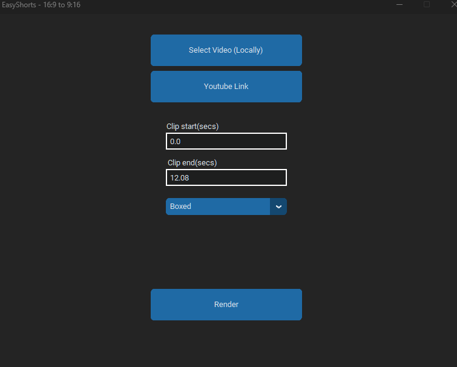

# Video2Short
Convert an existing video to an short by selecting a layout. Supports Youtube and local videos.        

Download the latest exe for windows from releases and run the file to have your video edited!         
For non-windows operating systems, Run it using python directly. See - [Getting Started](#getting_started)    

   

## Getting Started 

These instructions will get you a copy of the project up and running on your local machine for development and testing purposes. See 

Clone this project, and run [pip install -r requirements.txt] and run main.py.      
        

